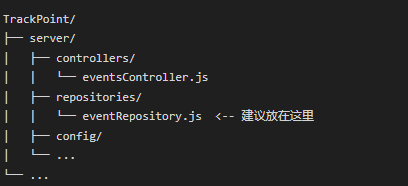

# TrackPoint
### 项目运行
sql文件运行顺序，先运行init_data.sql，这个是一些基础数据；再运行visual_data.sql，这个是初始化可视化数据

### 可能会遇到的问题：
时间转换：因为数据库中的时间存储和读取时可能涉及时区转换问题，所以在代码中需要进行时区转换

原因分析：数据库时区设置。数据库可能使用了 UTC 时区存储时间，而你的本地时区是东八区（UTC+8）。
例如，2025-02-15 10:05:22 在 UTC 时区下存储为 2025-02-15 02:05:22，读取时根据本地时区转换后显示为 2025-02-15 10:05:22。

解决方案：检查数据库时区
确保数据库的时区设置正确。可以通过以下 SQL 查询当前时区：
```
SELECT @@global.time_zone, @@session.time_zone;
```
如果时区不是 +08:00，可以通过以下命令修改：
```
SET GLOBAL time_zone = '+08:00';
SET SESSION time_zone = '+08:00';
```

| 特性 | 事件（Event） | 埋点（Tracking） | 
|----------|--------------------------|-----------------------------|
 | 性质 | 预定义的业务动作 | 事件发生的具体实例 | 
 | 数据特点 | 相对静态，定义后不常改变 | 动态变化，每次发生都会产生新的记录 | 
 | 存储内容 | 事件的基本信息和属性定义 | 事件发生的上下文信息和具体数据 | 
 | 使用场景 | 用于定义需要追踪的业务动作 | 用于记录和分析用户行为 | 
 | 数据量 | 数量较少，与业务动作数量相关 | 数量庞大，与用户行为频率相关 | 
 | 示例 | 定义"登录"、"注册"、"购买"等事件 | 记录用户A在14:00登录，用户B在15:00购买商品等 |

场景：一个电商网站的"加入购物车"功能

事件（Event）：
定义：这是一个预定义的业务动作，在系统中需要被追踪
例子：在系统中定义"add_to_cart"事件
属性：
事件名称：add_to_cart
描述：用户将商品加入购物车
状态：启用
创建时间：2023-01-01
更新时间：2023-01-01

埋点（Tracking）：
定义：这是事件发生的具体实例，包含实际发生时的详细数据
例子：用户A将商品B加入购物车
数据：
事件ID：add_to_cart事件的ID
用户ID：user_123
设备ID：device_456
商品ID：product_789
加入时间：2023-10-01 14:30:00
商品价格：99.99
商品数量：2

表结构清晰，易于扩展
通过索引优化查询性能
支持事件属性的动态扩展
记录了详细的埋点上下文信息
通过设计模式提高了代码的可维护性和扩展性

在控制器代码中，采用以下设计模式：  
Repository 模式：将数据库操作抽象到单独的Repository层，实现数据访问与业务逻辑的解耦。  
这样组织项目结构的好处是：  
清晰的职责分离：将数据访问逻辑与业务逻辑分离
更好的可维护性：所有Repository类集中在一个目录下
易于扩展：新增Repository时可以直接放在这个目录下
符合MVC模式：Repository层作为Model层的一部分


| 参数名 | 值示例 | 说明 |
 |--------------|--------------------|-----------------------------------------| 
 | event_id | 123 | 事件ID，对应"加入购物车"事件的ID |
 | user_id | "user_123" | 用户唯一标识 | 
 | event_time | "2023-10-01T14:30:00Z" | 事件发生时间，ISO 8601格式 | 
 | attributes | 数组 | 事件附加属性列表 | 
 | - attribute_id | 1 | 属性ID，对应事件定义时设置的属性ID | 
 | - attribute_value | "product_789" | 属性值，根据属性类型可以是字符串、数字等 |

数据库存储结果：  
tracking_data 表
| id | event_id | user_id | device_id | event_time | 
|-----|----------|----------|------------|---------------------| 
| 1 | 123 | user_123 | device_456 | 2023-10-01 14:30:00 |

tracking_attributes 表：  
| id | tracking_id | attribute_id | attribute_value |
|-----|-------------|--------------|-----------------| 
| 1 | 1 | 1 | product_789 | 
| 2 | 1 | 2 | 99.99 | 
| 3 | 1 | 3 | 2 |

